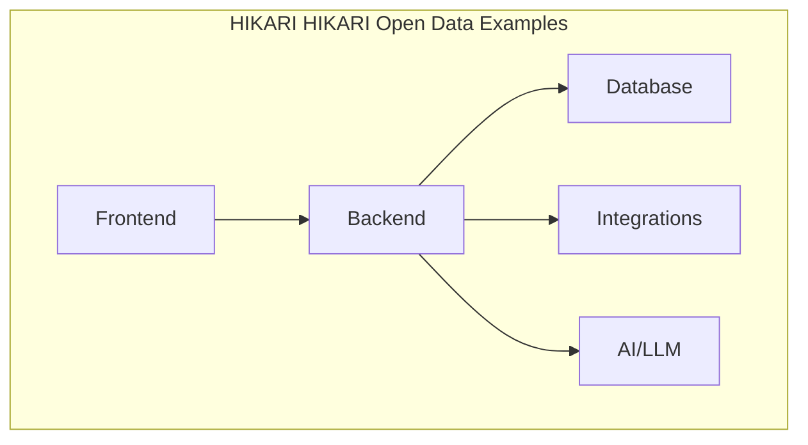

<div align="center">

# 🏔️ HIKARI Open Data Examples

**Exemples d'utilisation de données immobilières publiques françaises — DVF, DPE, cadastre**

[](./LICENSE) []() [](https://www.typescriptlang.org/) [](https://leafletjs.com/) []()
[](./CHANGELOG.md)
[](./CONTRIBUTING.md)
[](https://github.com/HIKARI-GROUP/hikari-open-data-examples)
[](https://github.com/HIKARI-GROUP/hikari-open-data-examples/commits)
[](https://github.com/HIKARI-GROUP/hikari-open-data-examples/discussions)

[📖 Documentation](./docs/) · [🗺️ Roadmap](./ROADMAP.md) · [🤝 Contributing](./CONTRIBUTING.md) · [💻 Examples](./examples/) · [🧪 Tests](./tests/) · [🤖 AI](./ai/) · [💼 Careers](./CAREERS.md)

</div>

---

## 📋 Overview

Example code and visualizations using French public real estate data sources: DVF (Demandes de Valeurs Foncières), DPE (energy performance), cadastre, and INSEE demographics.

## ✨ Features

- 🏠 DVF transaction data fetching
- 🔋 DPE energy performance lookup
- 🗺️ Interactive Leaflet maps
- 📊 Price per m² visualization
- 📈 Market trend charts
- 🏘️ Neighborhood analysis
- 🔍 Anonymized synthetic datasets

## 🏗️ Architecture



See [Architecture](./docs/Architecture.md) for full details.

## 🚀 Installation

```bash
git clone https://github.com/HIKARI-GROUP/hikari-open-data-examples.git
```

## 📖 Usage

```javascript
import { fetchDvfByPostalCode } from "./dvf";

const sales = await fetchDvfByPostalCode("69001", 2024);
console.log(sales); // [{ price, surface, date, type, ... }]
```

## 📁 Project Structure

```
hikari-open-data-examples/
├── examples/
│   ├── dvf-by-postal-code.js
│   ├── dvf-map/
│   └── dpe-lookup.js
├── src/
│   ├── dvf.ts           # DVF API client
│   ├── dpe.ts           # DPE utilities
│   └── cadastre.ts      # Cadastre data
├── datasets/            # Synthetic sample data
└── docs/
```

## 🛠️ Technologies

- JavaScript
- TypeScript
- Leaflet
- Data Visualization

## 📚 Documentation

| Document | Description |
|---|---|
| [Architecture](./docs/Architecture.md) | System architecture and design decisions |
| [Backend](./docs/Backend.md) | Backend services and API |
| [Frontend](./docs/Frontend.md) | Frontend architecture |
| [Database](./docs/Database.md) | Database schema and operations |
| [API](./docs/API.md) | API conventions |
| [Authentication](./docs/Authentication.md) | Auth flows |
| [Security](./docs/Security.md) | Security practices |
| [Deployment](./docs/Deployment.md) | Deployment guide |
| [Coding Standards](./docs/Coding-Standards.md) | Code conventions |
| [Testing](./docs/Testing.md) | Testing guide |
| [CI-CD](./docs/CI-CD.md) | CI/CD pipeline |
| [Git Workflow](./docs/Git-Workflow.md) | Branching & PR process |
| [Onboarding](./docs/Developer-Onboarding.md) | Developer onboarding |
| [Environment](./docs/Environment.md) | Environment setup |

## 🗺️ Roadmap

See [ROADMAP.md](./ROADMAP.md) for our full vision.

## 🤝 Contributing

We welcome contributions! Please read [CONTRIBUTING.md](./CONTRIBUTING.md) first.

- 🐛 [Report a bug](https://github.com/HIKARI-GROUP/hikari-open-data-examples/issues/new?labels=bug)
- 💡 [Request a feature](https://github.com/HIKARI-GROUP/hikari-open-data-examples/issues/new?labels=enhancement)
- 📝 [Improve docs](https://github.com/HIKARI-GROUP/hikari-open-data-examples/issues/new?labels=documentation)
- 🔍 [Good first issues](https://github.com/HIKARI-GROUP/hikari-open-data-examples/labels/good%20first%20issue)

## 📄 License

MIT © HIKARI GROUP

## 💼 Careers

We're hiring! See [CAREERS.md](./CAREERS.md) for open positions.

## 🌐 Links

- 🏢 [HIKARI GROUP](https://github.com/HIKARI-GROUP)
- 🌍 [Website](https://hikari-group.tech)
- 💼 [LinkedIn](https://www.linkedin.com/company/hikari-group)
- 📧 [Contact](mailto:contact@hikari-group.tech)

---

<div align="center">
  <sub>Built with ❤️ by <a href="https://github.com/HIKARI-GROUP">HIKARI GROUP</a></sub>
</div>
